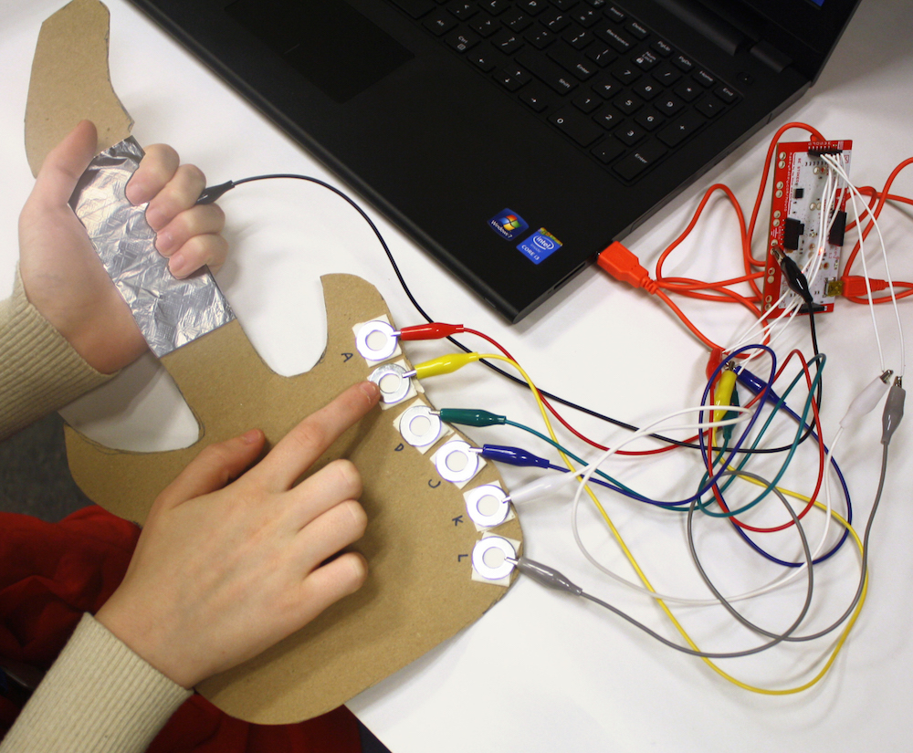
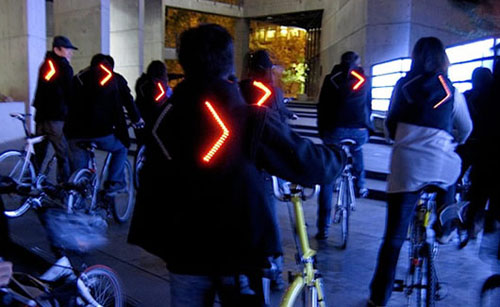
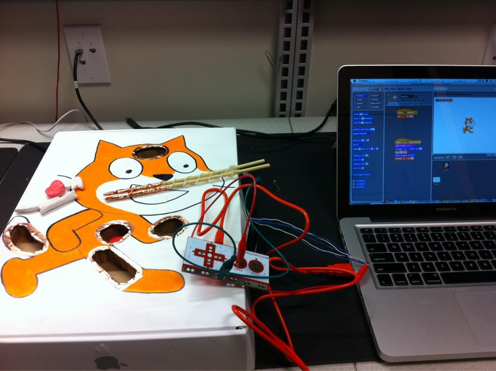

# Physical Computing with MaKey MaKeys

## UON CS4PS

### Presented by Daniel Hickmott

---

# Session Plan

- Presentation: Overview of Physical Computing (~15 minutes)
- Hands-On Activities (~1 hour)

---

# Presentation Contents

- What is Physical Computing?
- Physical Computing & the DT curriculum
- Examples of Physical Computing devices
- MaKey MaKeys
- Physical Computing Activities

---

# What is Physical Computing?

- Usually refers to hardware or software that involves:
	- Physical interaction (not with a keyboard & mouse)
	- The use of sensors to collect data

- Interacting with a motion sensor (e.g. the Microsoft Kinect)

- Sensors can be used to record information, e.g. temperature, humidity and noise levels

---

# Physical Computing in ACARA DT

- Years 3 & 4: "_Identify and explore a range of digital systems with **peripheral devices** for different purposes, and transmit different types of data (ACTDIK007)_" 
- Years 5 & 6: "_Design a **user interface** for a digital system (ACTDIP018)_" **&** "_Examine the main components of common digital systems and how they may **connect together** to form networks to transmit data (ACTDIK014)_"

---

---

# Examples: Raspberry Pi

---

# Examples: Raspberry Pi

- A computer the size of a credit card
- Originated from the UK
- Can interact with sensors and cameras
- Has a big community - the Raspberry Pi Foundation

---

# Examples: Wearables

---

# Examples: Wearables

- Devices, like the Lilypad Arduio, can be sewed onto fabric
- Can be used for electronic textiles
- e.g. Clothing that have LED lights that change colours to music
- Growing area in research and industry

---

# MaKey MaKey

---

# MaKey MaKey

- "An Invention Kit for Everyone"
- Use everyday, conductive, objects to interact with your computer
- e.g. Make a Piano out of bananas or a game controller from Play Doh
- Can interact with all applications, but today we'll use it with Scratch

---

# Physical Computing Activities

- Go to the Scratch website: www.scratch.mit.edu
- We have two tutorials for you to complete:
  - Making a Piano
  - Making an Interactive Quiz
- Let us know if you have any questions about MaKey MaKeys or the other devices we mentioned
